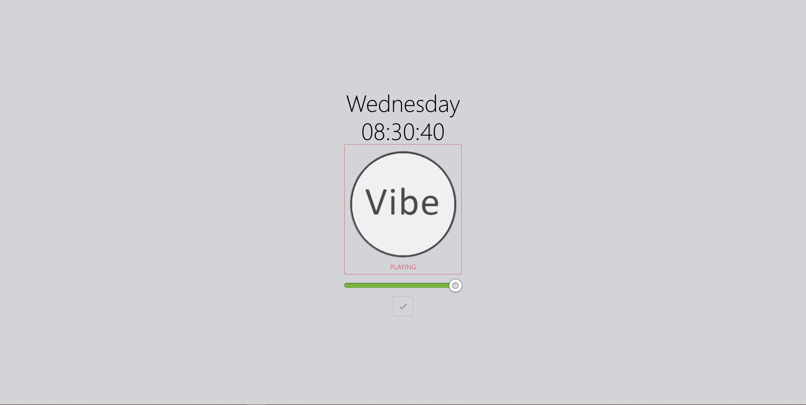
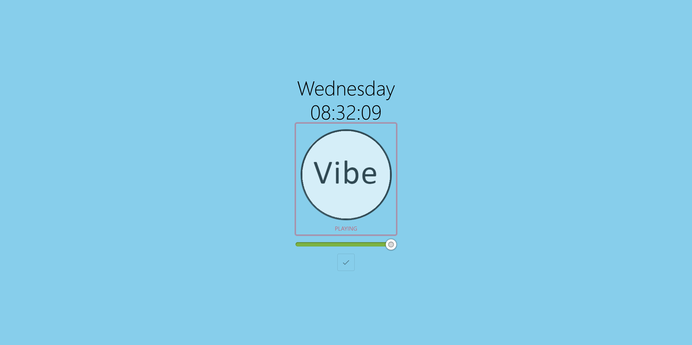

# Vibes
A little website where you can play songs a certain time. It will play all songs in sync (within a couple of seconds) with everyone in the same time zone.
It also updates the background based on time of day and local weather conditions.

## Building
Refer to make file

## Running
Refer to make file

### Configuring
Refer to `example_config.json`, dockerfile and top part of the main python script for what env vars to set.

## Example

Overcast daytime

Clear Skys daytime

